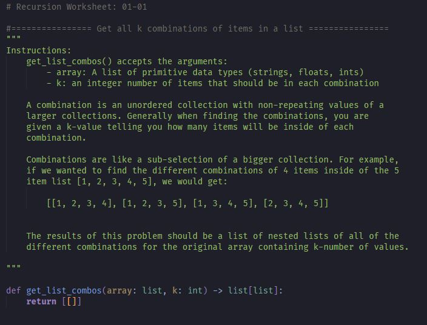
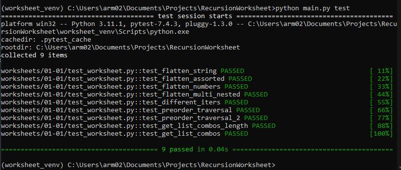

# Recursion Worksheet Generator

## Description

 Creates python worksheets with random recursive functions from the book "The Recursive Book of Recursion" by Al Sweigart along with a pytest test file to check answers.  

 Inside of the RecursionWorksheet folder in the terminal you can run the command

        python main.py make -n 3

This will create a worksheet in the worksheets\mm-dd\worksheet.py with three random recursive algorithms for the user to fill out.

 

Once you are done finishing writing the algorithms, you can test them by running the command:

        python main.py test
 
The terminal will print the pytest results

 ## Requirements

- python 
- pytest 

 ## Basic Usage

- Download or clone repository on your computer via the green <> Code dropdown menu. 

- pip install pytest inside of virtual environment  

        pip install pytest

- Inside of the RecursionWorksheet directory in the terminal or command line run the following code to create a new worksheet with 10 different algorithms. 

        python main.py make -n 10 

- Inside of the worksheet/mm-dd folder there should be two new files:
    1. worksheet.py
    2. test_worksheet.py

- The worksheet.py file will have the the functions defined with a short description detailing what algorithm the function should complete. 

     

- Once you are done writing out the answers you can test your worksheet by running the following command  

        python main.py test

## Details

#### There program has four different commands.  If you try to run the main.py script without one of these four commands then the program will return with an error message.

1. make - Creates a new worksheet.py file inside of the worksheet/MM-DD directory along with a test_worksheet.py file used to test. 

2. test - Runs pytest and prints results to the terminal. 

3. clean - Removes all of the tests inside of the worksheets/ directory

4. remove - Removes one worksheet

#### There are two optional command line arguments.  If you don't include these the program will assume the default values. 

        1. -n Specify the number of worksheets to create.  The default is set at 5. "make" is the only command that uses the -n command.

        2. -d specify the date (or what you want to name the folder). The default is set at today's date. 

  

## Examples commands :

#### Create a worksheet with 7 different recursive algorithms.

        python main.py make -n 7

#### Test a worksheet you created on 12-11.

        python main.py test -d 12-11

#### Create a worksheet with 3 different algorithms in a folder named "i_love_corgis"

        python main.py make -n 3 -d i_love_corgis

#### Test worksheet from previous example 

        python main.py test -d i_love_corgis

#### Remove the worksheet from the i_hate_recursion folder

        python main.py remove -d i_love_corgis

#### Permanently delete all of the files and worksheets in the worksheets folder

        python main.py clean